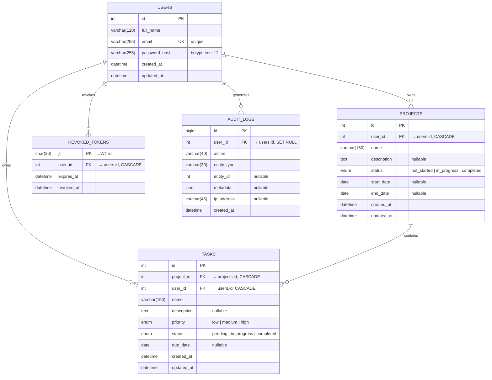

# Database Schema

MySQL 8.0, InnoDB, `utf8mb4` / `utf8mb4_unicode_ci` throughout.
The authoritative definition is [`server/src/db/schema.sql`](../server/src/db/schema.sql).

## ER Diagram



### Text version

```
users (1) ──────< (N) projects (1) ──────< (N) tasks
  │                                              ▲
  └──────────────────────────────────────────────┘
                 (owner shortcut)

users (1) ──< (N) revoked_tokens
users (1) ──< (N) audit_logs
```

## Relationships

| From | To | Type | On delete |
| --- | --- | --- | --- |
| `projects.user_id` | `users.id` | many-to-one | `CASCADE` |
| `tasks.project_id` | `projects.id` | many-to-one | `CASCADE` |
| `tasks.user_id` | `users.id` | many-to-one | `CASCADE` |
| `revoked_tokens.user_id` | `users.id` | many-to-one | `CASCADE` |
| `audit_logs.user_id` | `users.id` | many-to-one | `SET NULL` |

Deleting a user removes their projects, which removes those projects' tasks. No
orphan rows can survive.

## Design decisions

**Normalisation (3NF).** Every non-key column depends on the whole primary key
and nothing but the key. There are no repeating groups, no comma-separated
lists and no computed values stored on the row — task counts and progress
percentages are aggregated at query time.

**`tasks.user_id` is a deliberate denormalisation.** It duplicates a fact that
is already derivable (`tasks → projects → user_id`). It is kept for two
reasons:

1. *Authorisation.* Every task query carries `WHERE t.user_id = ?`, so the
   ownership check is a single indexed predicate rather than a join the code
   could forget to add.
2. *Performance.* "All tasks for this user" and every dashboard aggregate then
   read a single index instead of joining to `projects`.

It cannot drift, because the API derives it from the parent project on every
insert and update and never accepts it from a client (see
`server/src/modules/tasks/task.service.js`).

**Enums in the database, not just the application.** `status` and `priority`
are native MySQL `ENUM`s, so an invalid value is rejected by the engine even if
a bug lets one past the validation layer. `priority` is declared
`low, medium, high` so ordering by it sorts naturally.

**Indexes.** Composite indexes are ordered `(user_id, <filter column>)` to
match the shape of every query the API issues — the ownership predicate first,
then the search/filter predicate:

| Table | Index | Serves |
| --- | --- | --- |
| `users` | `uq_users_email` (unique) | login lookup, unique-email enforcement |
| `projects` | `idx_projects_user_status` | list + filter by status |
| `projects` | `idx_projects_user_name` | search by name, sort by name |
| `tasks` | `idx_tasks_project` | tasks within a project |
| `tasks` | `idx_tasks_user_status` | filter by status, dashboard counts |
| `tasks` | `idx_tasks_user_priority` | filter by priority |
| `tasks` | `idx_tasks_user_name` | search by name |
| `revoked_tokens` | `idx_revoked_expires` | pruning expired entries |
| `audit_logs` | `idx_audit_user_created` | activity feed |

**Dates vs timestamps.** `start_date`, `end_date` and `due_date` are `DATE` —
they are calendar days, and storing them as timestamps would make them shift
across time zones. `created_at` / `updated_at` are `DATETIME` with automatic
maintenance by the engine.

**`revoked_tokens`.** JWTs are stateless, so logging out would otherwise be a
client-side gesture only. Logout inserts the token's `jti` here and the auth
middleware rejects any token whose `jti` is present, which makes logout
effective server-side. Rows past their expiry are pruned opportunistically on
each logout.
